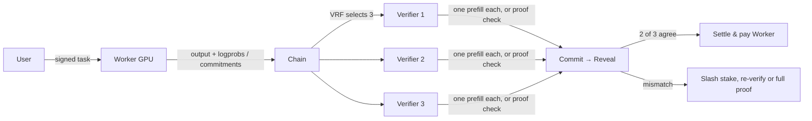

  

<h1 align="center">Verifiable and Private AI Inference</h1>

  TrueOpen is an open GPU network for serving open-source models with
  verifiable computation and privacy protection.

  <a href="https://trueopen.ai">Website</a> &middot;
  <a href="https://github.com/TrueOpen/docs/blob/main/content/assets/TrueOpen_Whitepaper.pdf">Whitepaper</a> &middot;
  <a href="https://github.com/TrueOpen/docs">Documentation</a> &middot;
  <a href="https://trueopen.ai/research.html">Research</a> &middot;
  <a href="https://trueopen.ai/roadmap.html">Roadmap</a>

---

## What we are building

| Verifiable inference | Private by design | Open coordination |
| --- | --- | --- |
| Verify that remote inference used the agreed model, precision, and computation. | Authorize tasks with cryptographic keys and protect inputs and results with encryption. | Coordinate distributed GPUs through efficient off-chain data paths and auditable protocol records. |

Open-source model weights are only the beginning. Users also need confidence that remote computation was performed as agreed, without giving up control of their data.

## How verification works

Re-running a generation costs as much as the generation itself, and a full cryptographic proof of a large model is far more expensive. TrueOpen therefore uses two mechanisms that verify the *whole* answer while paying for only a *fraction* of the compute, and lets stake and penalties turn a partial detection probability into a full economic deterrent.

- **Logprob Majority-Consensus Verification (LMCV)** — three independently selected Verifiers each run one parallel teacher-forced prefill over the Worker's `input + output`, check every token's log-probability, rank and top-*k* membership (plus layer-0 expert routing for MoE models), commit their results, then reveal. Two matching results form the verdict.
- **Sampled Layerwise Proofs (SLP)** — for fixed-point quantized models, the Worker commits every layer-group boundary before random sampling; the two end chunks and a random sample of inner chunks are proven cryptographically. The verifier checks the proof without the model weights and can escalate to a full proof over the same commitments.

**Measured cost** (single runs; conditions in the linked reports):

| What | Result | Conditions |
| --- | --- | --- |
| One LMCV verification pass | ≈ 1% of the generation's GPU time (Worker/Verifier ≈ 80×–114×) | Qwen3-8B BF16, single RTX 4090, vLLM, input×output length grid; the only exception is 1-token outputs |
| Three LMCV Verifiers together | 1.9%–14.8% of one generation | same benchmark |
| LMCV model identity | Same-model BF16 replays stay in a narrow band across 6000ws / H100 / 4090 / L4; FP8, AWQ and smaller substitutes separate on p99, rank-delta and top-*k* overlap; MoE layer-0 routing reaches TPR 1.000 with zero false passes at threshold 0.060 | Qwen3-32B, Qwen3-8B, Qwen3.6-35B-A3B |
| SLP on Llama-2-70B | Seal 163 boundaries + prove 5 chunks: 1,259 s; proof 4.34 MiB; verify 46 s with no access to weights | 256-thread CPU server, 2 TB RAM, context 8, 3 sampled chunks + 2 anchors |
| SLP sampled vs. full proof | s = 5: 22% of full proving time, 6.8% of proof size, 9.6% of verification time | TinyLlama-1.1B, 47 chunks, host CPU |
| SLP batching | 12 concurrent requests in one proof: 181.9 s, ≈ 6.5× cheaper than separate proofs | TinyLlama-1.1B, slot length 16 |
| SLP detection limit | Single-audit detection = sampling coverage (1.9% at 70B with s = 3); a post-sealing beacon removes the Fiat–Shamir grinding attack | analytical + measured |

Why this is affordable: verification runs on a prefill, not a decode, so it is memory-bandwidth-cheap and parallel; only two of three Verifiers need to agree; proofs cover a sample rather than every layer; and because a Worker's stake is at risk on every audit, even a low per-audit detection probability makes cheating unprofitable over repeated tasks.

Reports and code: [LMCV paper](https://github.com/TrueOpen/lmcv-experiments/blob/main/paper/LMCV.md) · [LMCV experiments and tools](https://github.com/TrueOpen/lmcv-experiments) · [SLP experiment report](https://github.com/TrueOpen/slp-experiments/blob/main/REPORT.md) · [SLP raw data](https://github.com/TrueOpen/slp-experiments) · [Verification overview](https://trueopen.ai/verification.html)

## Explore TrueOpen

- [Whitepaper (PDF)](https://github.com/TrueOpen/docs/blob/main/content/assets/TrueOpen_Whitepaper.pdf)
- [Whitepaper (web)](https://github.com/TrueOpen/docs/blob/main/content/whitepaper.md)
- [Protocol documentation](https://github.com/TrueOpen/docs)
- [Verification research](https://trueopen.ai/verification.html)
- [Research and experimental reports](https://trueopen.ai/research.html)
- [End-to-end task flow](https://trueopen.ai/task-flow.html)
- [Performance and scaling](https://trueopen.ai/scaling.html)
- [Development roadmap](https://trueopen.ai/roadmap.html)

## Current status

TrueOpen is in active research, protocol design, and development.

Specifications and interfaces may evolve as verification methods, privacy mechanisms, and network coordination are tested. Production network access and compatible wallet integrations are not yet generally available.

## Build with us

We welcome contributors with experience in:

- AI inference and model verification
- Distributed GPU systems
- Applied cryptography and privacy
- Blockchain and consensus protocols
- SDKs, developer tooling, and infrastructure

Start with the [documentation](https://github.com/TrueOpen/docs), then open an issue to share a question or proposal.

## Security

TrueOpen will never ask for your wallet seed phrase or private key.

Use only links published on [trueopen.ai](https://trueopen.ai) and repositories under the [TrueOpen](https://github.com/TrueOpen) organization.

---

  <a href="https://trueopen.ai">trueopen.ai</a> &middot;
  <a href="mailto:service@trueopen.ai">service@trueopen.ai</a>

